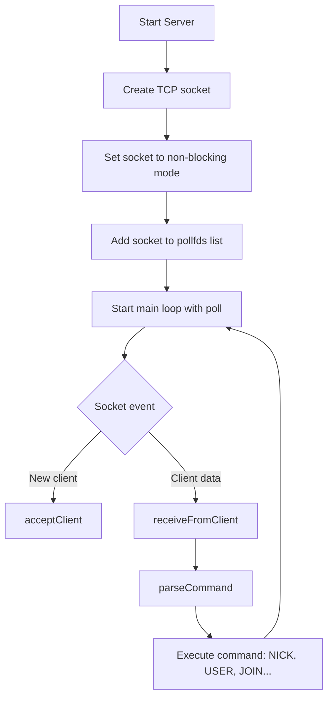

# ft_irc

This project is an implementation of an IRC (Internet Relay Chat) server using **C++**, TCP sockets, and event-driven programming with **poll()**. The server is capable of handling multiple simultaneous connections, interpreting IRC protocol commands such as `PASS`, `NICK`, `USER`, `JOIN`, `PRIVMSG`, among others.

> **This project was developed based on specific rules and requirements.**
> The goal is to understand and apply concepts of networking, TCP sockets, protocols, and event-driven architecture.

---

## General Architecture

The project follows an architecture based on:

- **Event Loop (Reactor Pattern)**: A main loop monitors all sockets using `poll()` and dispatches processing according to the type of event.
- **Command Modularization**: The logic for IRC commands is separated into specific functions, improving organization and maintainability.
- **Non-blocking Sockets**: All sockets are set to `O_NONBLOCK`, allowing asynchronous I/O without the need for multiple threads.

---

## Design Patterns Used

### 1. **Reactor Pattern (Event-driven)**
Responsible for monitoring all socket descriptors and reacting to events (read, connect).

📍 **Code location:**
`srcs/Server.cpp`
Lines: `poll()` at line 155 to the loop at 197

```cpp
int pollCount = poll(pollfds.data(), pollfds.size(), -1);
for (size_t i = 0; i < pollfds.size(); ++i) {
    if (pollfds[i].revents & POLLIN) {
        if (pollfds[i].fd == serverSocket) {
            acceptClient();
        } else {
            receiveFromClient(i);
        }
    }
}
```

---

### 2. **Non-blocking Socket**
Ensures that `recv()` and `send()` calls do not block the main loop.

📍 **Code location:**
`srcs/Server.cpp`, line 110

```cpp
fcntl(clientSocket, F_SETFL, O_NONBLOCK);
```

---

### 3. **Command as Strategy (Strategy-like)**
Each IRC command is handled by a modular function.

📍 **Code location:**
`srcs/Command.cpp`
Example:

```cpp
void handleNick(std::vector<std::string> args, Client &client, Server &server);
```

---

### 4. **Centralized Client Management with pollfd**
All sockets (server and clients) are stored in a vector monitored by `poll()`.

📍 **Code location:**
`Server.hpp`, line 35

```cpp
std::vector<pollfd> pollfds;
```

---

## Server Flow (Mermaid)



---

## Directory Structure

```
includes/
│   ├── Channel.hpp
│   ├── Client.hpp
│   ├── Response.hpp
│   └── Server.hpp
srcs/
│   ├── Channel.cpp
│   ├── Client.cpp
│   ├── main.cpp
│   ├── Server.cpp
│   ├── commands/
│   │   ├── invite_cmd.cpp
│   │   ├── join_cmd.cpp
│   │   └── ... (other commands)
│   └── utils_and_flags/
│       ├── messages.cpp
│       ├── mode_invite.cpp
│       └── ... (other utilities)
```

---

## Lessons Learned

- **Event-driven architecture with `poll()`**: We learned to use I/O multiplexing to manage multiple simultaneous connections efficiently, without blocking the main process.

- **Non-blocking socket usage**: We understood how to operate with asynchronous sockets, avoiding crashes and ensuring smooth communication between client and server.

- **IRC command modularization**: Separating commands into independent files improved code readability, maintenance, and extensibility.

- **Core networking concepts**:
  - TCP connection handshake
  - Connection and reconnection handling
  - Text-based protocols (IRC)

- **Operating system principles in practice**:
  - File descriptor management
  - Signal handling and graceful shutdown
  - Client state and concurrency control

- **Applying good practices in C++98**:
  - Encapsulation and single responsibility
  - Managing strings, vectors, and maps without modern STL
  - Manual memory management with attention to leaks

- **Incremental development with manual testing**: Interactive testing via telnet, netcat, and HexChat.

- **Team communication and collaboration**: Division of tasks and Git version control to help the team synchronize during development.
